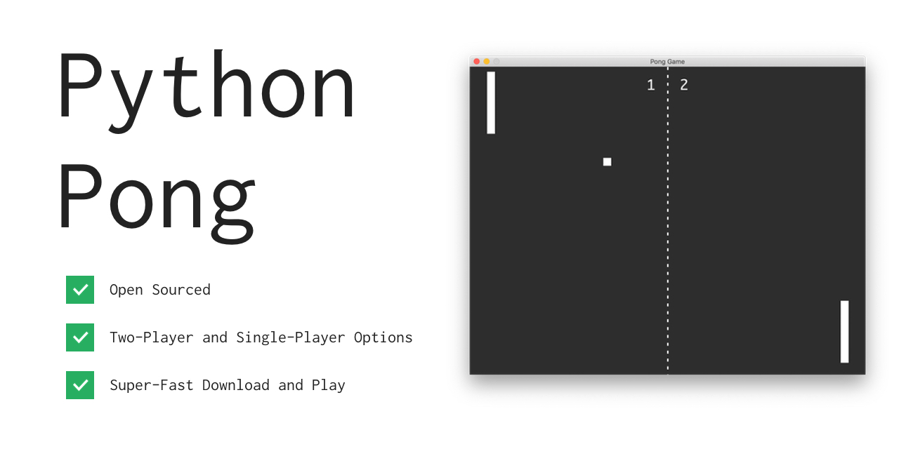

# Python Pong
The classic pong game made in [Python Tkinter](https://docs.python.org/2/library/tkinter.html). Written for Python2 by [Fred Adams](https://xtrp.io/). Licensed under the [MIT License](https://choosealicense.com/licenses/mit/).


## Overview
The game is just like the original: the classic digital 2D table tennis game. Two-player and one-player (against AI) options are available.

The code is well commented, and only requires Python2 to be installed, however, it does use Tkinter, which should come pre-installed with Python2, but may not be for various reasons. Additional download information is below.

## Download and Play
 1. Make sure you have Python installed. Install Python at [python.org](https://www.python.org/downloads/). Most computers running macOS should have Python pre-installed. Check if you have Python installed by typing the command ```python``` and pressing enter in your command prompt or terminal. If a prompt like ```>>>``` shows up, then Python is installed.
 2.
	* <strong>For two-player game:</strong> Run the following command to download and play Python Pong two-player! Note that this will download a file called ```pong.py``` into your current working directory.
	 
	```bash
	curl https://xtrp.github.io/python-pong/pong_two_player.py -o pong.py && python pong.py
	```
	
	* <strong>For one-player game vs/AI:</strong> Run the following command to download and play Python Pong one-player! Note that this will download a file called ```pong.py``` into your current working directory.
	 
	```bash
	curl https://xtrp.github.io/python-pong/pong_one_player.py -o pong.py && python pong.py
	```

## Bugs or Issues
If you find a bug or have an issue with Python Pong, feel free to [Submit an Issue](https://github.com/xtrp/python-pong/issues/new).
